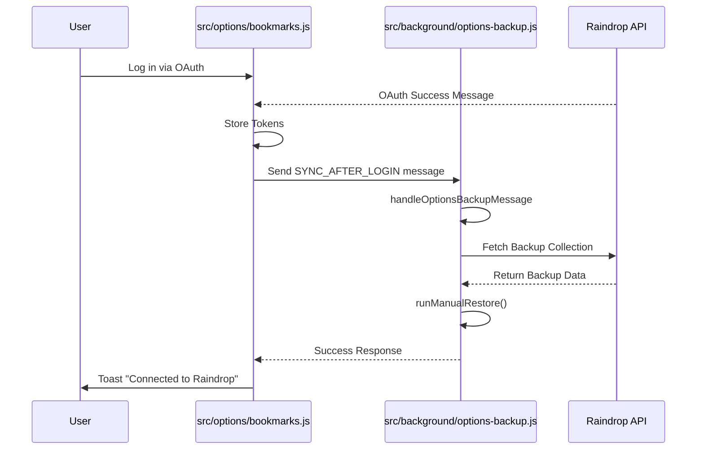

# SYNC_AFTER_LOGIN Lifecycle

This document describes the lifecycle of the `SYNC_AFTER_LOGIN` event, which ensures that extension options are restored from Raindrop upon a successful login, rather than overwriting cloud settings with local defaults.

## Overview

When a user logs in to Raindrop via the extension options page, the following sequence of events occurs:

1.  **OAuth Success:** The extension receives an external message indicating successful authentication.
2.  **Trigger:** The options page processes this success and sends a runtime message to the background script.
3.  **Handling:** The background script receives the message and triggers the restoration process.
4.  **Action:** The extension fetches the latest options backup from Raindrop and applies it to local storage.

## Detailed Flow

### 1. OAuth Success (Frontend)

*   **File:** `src/options/bookmarks.js`
*   **Function:** `processOAuthSuccess(message)`
*   **Event:** `chrome.runtime.onMessageExternal` receives `{ type: 'oauth_success', ... }`.

After validating and storing the tokens, the function sends a message to the background script to initiate the sync.

```javascript
// src/options/bookmarks.js

await sendRuntimeMessage({
  type: OPTIONS_BACKUP_MESSAGES.SYNC_AFTER_LOGIN, // 'optionsBackup:syncAfterLogin'
});
```

### 2. Message Dispatch (Shared)

*   **File:** `src/shared/optionsBackupMessages.js`
*   **Constant:** `OPTIONS_BACKUP_MESSAGES.SYNC_AFTER_LOGIN`

This constant defines the message type string used for communication between the options page and the background script.

```javascript
export const OPTIONS_BACKUP_MESSAGES = {
  // ...
  SYNC_AFTER_LOGIN: 'optionsBackup:syncAfterLogin',
};
```

### 3. Background Handling (Backend)

*   **File:** `src/background/index.js` -> `src/background/options-backup.js`
*   **Function:** `handleOptionsBackupMessage(message, sendResponse)`

The background script listens for runtime messages. When it receives the `SYNC_AFTER_LOGIN` message, it calls the handler.

```javascript
// src/background/options-backup.js

export function handleOptionsBackupMessage(message, sendResponse) {
  // ...
  switch (message.type) {
    // ...
    case OPTIONS_BACKUP_MESSAGES.SYNC_AFTER_LOGIN: {
      void runManualRestore()
        .then((result) => sendResponse(result))
        // ... error handling
      return true;
    }
    // ...
  }
}
```

### 4. Execution (Backend)

*   **File:** `src/background/options-backup.js`
*   **Function:** `runManualRestore()`

This function performs the actual work:
1.  Loads valid tokens.
2.  Finds the backup collection in Raindrop.
3.  Downloads and reassembles the backup chunks.
4.  Applies the backup payload to `chrome.storage.local`.

## Diagram


