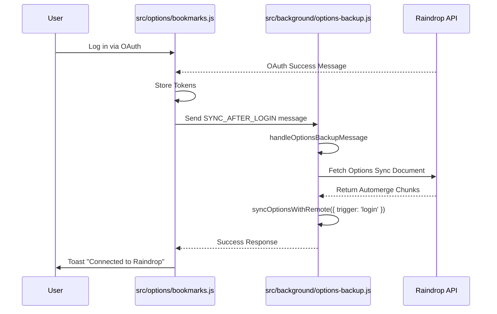

# SYNC_AFTER_LOGIN Lifecycle

This document describes the lifecycle of the `SYNC_AFTER_LOGIN` event, which ensures that extension options are merged with Raindrop upon a successful login, rather than overwriting cloud settings with local defaults.

## Overview

When a user logs in to Raindrop via the extension options page, the following sequence of events occurs:

1.  **OAuth Success:** The extension receives an external message indicating successful authentication.
2.  **Trigger:** The options page processes this success and sends a runtime message to the background script.
3.  **Handling:** The background script receives the message and triggers the sync process.
4.  **Action:** The extension fetches the latest Automerge options document from Raindrop, merges it with local state, and applies the merged result to local storage.

## Detailed Flow

### 1. OAuth Success (Frontend)

*   **File:** `src/options/bookmarks.js`
*   **Function:** `processOAuthSuccess(message)`
*   **Event:** `chrome.runtime.onMessageExternal` receives `{ type: 'oauth_success', ... }`.

After validating and storing the tokens, the function sends a message to the background script to initiate the sync.

```javascript
// src/options/bookmarks.js

await sendRuntimeMessage({
  type: OPTIONS_BACKUP_MESSAGES.SYNC_AFTER_LOGIN, // 'optionsBackup:syncAfterLogin'
});
```

### 2. Message Dispatch (Shared)

*   **File:** `src/shared/optionsBackupMessages.js`
*   **Constant:** `OPTIONS_BACKUP_MESSAGES.SYNC_AFTER_LOGIN`

This constant defines the message type string used for communication between the options page and the background script.

```javascript
export const OPTIONS_BACKUP_MESSAGES = {
  // ...
  SYNC_AFTER_LOGIN: 'optionsBackup:syncAfterLogin',
};
```

### 3. Background Handling (Backend)

*   **File:** `src/background/index.js` -> `src/background/options-backup.js`
*   **Function:** `handleOptionsBackupMessage(message, sendResponse)`

The background script listens for runtime messages. When it receives the `SYNC_AFTER_LOGIN` message, it calls the handler.

```javascript
// src/background/options-backup.js

export function handleOptionsBackupMessage(message, sendResponse) {
  // ...
  switch (message.type) {
    // ...
    case OPTIONS_BACKUP_MESSAGES.SYNC_AFTER_LOGIN: {
      void syncOptionsWithRemote({ trigger: 'login' })
        .then((result) => sendResponse(result))
        // ... error handling
      return true;
    }
    // ...
  }
}
```

### 4. Execution (Backend)

*   **File:** `src/background/options-backup.js`
*   **Function:** `syncOptionsWithRemote({ trigger: 'login' })`

This function performs the actual work:
1.  Loads valid tokens.
2.  Finds or creates the options sync collection in Raindrop.
3.  Downloads and validates the Automerge chunks.
4.  Merges remote and local documents, then applies the merged options to `chrome.storage.local`.

## Diagram


```mermaid
sequenceDiagram
    participant User
    participant OptionsPage as src/options/bookmarks.js
    participant Background as src/background/options-backup.js
    participant Raindrop as Raindrop API

    User->>OptionsPage: Log in via OAuth
    Raindrop-->>OptionsPage: OAuth Success Message
    OptionsPage->>OptionsPage: Store Tokens
    OptionsPage->>Background: Send SYNC_AFTER_LOGIN message
    Background->>Background: handleOptionsBackupMessage
    Background->>Raindrop: Fetch Options Sync Document
    Raindrop-->>Background: Return Automerge Chunks
    Background->>Background: syncOptionsWithRemote({ trigger: 'login' })
    Background-->>OptionsPage: Success Response
    OptionsPage->>User: Toast "Connected to Raindrop"
```
