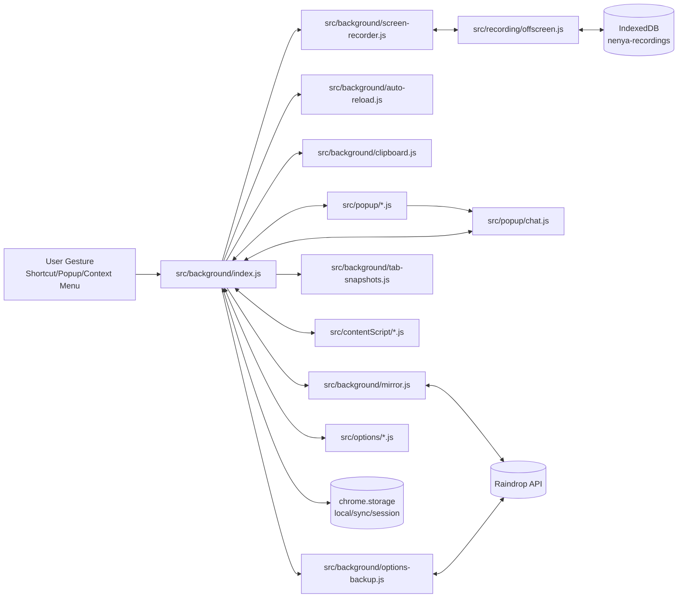
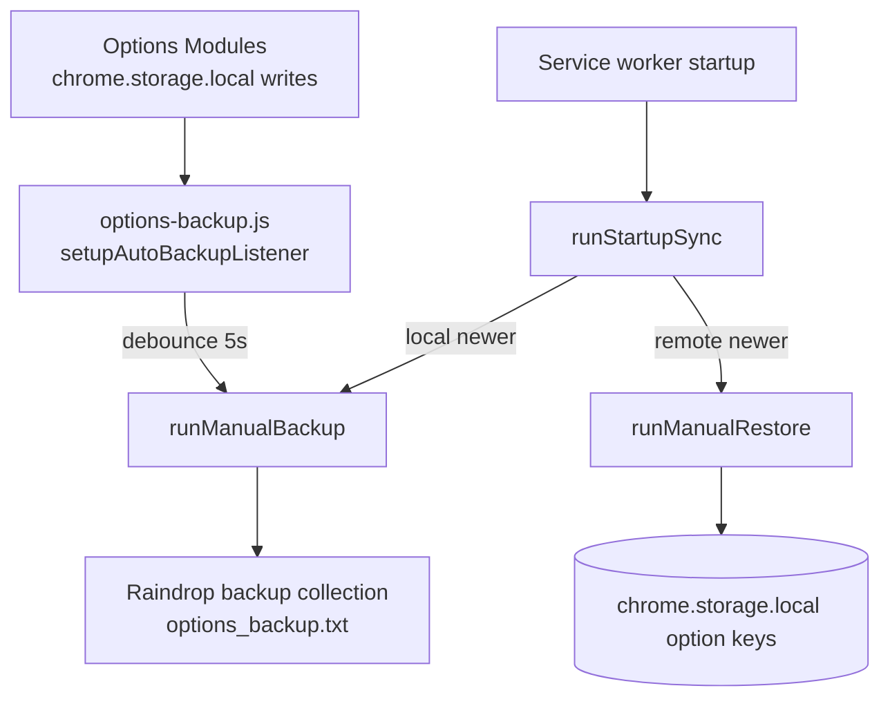

# Architecture

## System Overview
Nenya is a Manifest V3 Chrome extension. Runtime entry points are declared in `manifest.json`:
- Service worker: `src/background/index.js`
- Popup: `src/popup/index.html`
- Options: `src/options/index.html`
- Content scripts (always-on and targeted): `src/contentScript/*.js`
- Offscreen recording page: `src/recording/offscreen.html`

The service worker (`src/background/index.js`) is the orchestration hub:
- Keyboard command router via `chrome.commands.onCommand` (line 244).
- Runtime message router via `chrome.runtime.onMessage.addListener` (line 3103).
- Context menu click router via `chrome.contextMenus.onClicked` (line 4077).
- Startup/install lifecycle via `handleLifecycleEvent` (line 1836), `onInstalled` (line 1847), `onStartup` (line 1941).

## Component Boundaries
- `src/background/`
  - Core orchestration: `index.js`
  - Raindrop sync/sessions and notifications: `mirror.js`
  - Options backup/restore: `options-backup.js`
  - Auto reload scheduler: `auto-reload.js`
  - Clipboard/screenshot bridge: `clipboard.js`
  - Screen recording controller: `screen-recorder.js`
  - Tab snapshot capture: `tab-snapshots.js`
- `src/contentScript/`
  - Rule-driven page behaviors (dark/bright/block/highlight/custom code/video)
  - Page extraction and LLM injection (`getContent-*`, `pageContentCollector.js`, `llmPageInjector.js`)
  - UI overlays (`epicker.js`, `emoji-picker.js`, `tab-switcher.js`)
- `src/popup/`
  - Main UI and home reuse controller: `popup.js`
  - LLM chat UX: `chat.js`
  - Save/auth helpers: `mirror.js`, `shared.js`
- `src/options/`
  - Navigation shell: `options.js`
  - Per-feature config editors (one module per rule set)
  - OAuth and backup controls: `bookmarks.js`, `backup.js`, `importExport.js`
- `src/recording/`
  - MediaRecorder execution: `offscreen.js`
  - Playback/download UX: `preview.js`
  - IndexedDB persistence: `storage.js`
- `src/shared/`
  - Cross-context contracts/utilities (`contextMenus.js`, `llmProviders.js`, `urlProcessor.js`, `titleTransform.js`, `tokenRefresh.js`, `optionsBackupMessages.js`)

## Key Runtime Flows

### 1. Command/Message Dispatch Backbone
- Commands enter through `chrome.commands.onCommand` in `src/background/index.js:244`.
- UI/content requests enter through `chrome.runtime.onMessage` in `src/background/index.js:3103`.
- The dispatcher forwards feature-specific operations to:
  - `saveUrlsToUnsorted` (`src/background/mirror.js:1315`)
  - `handleOptionsBackupMessage` (`src/background/options-backup.js:987`)
  - `handleScreenRecorderMessage` (`src/background/screen-recorder.js:363`)
  - `evaluateAllTabs`/`handleAutoReloadAlarm` (`src/background/auto-reload.js:671`, `:937`)

### 2. Save to Raindrop Unsorted
- Entry points: command `bookmarks-save-to-unsorted`, context menu `RAINDROP_MENU_IDS.SAVE_PAGE`, popup action (`src/popup/mirror.js`), runtime message `mirror:saveToUnsorted`.
- URL normalization and rule processing: `normalizeHttpUrl` + `processUrl(..., 'save-to-raindrop')` in `src/background/mirror.js` and `src/shared/urlProcessor.js`.
- Batched create via Raindrop `/raindrops`: `raindropRequest` in `src/background/mirror.js:1744`.
- Optional screenshot cover upload: `/raindrop/{id}/cover` path in `saveUrlsToUnsorted`.

### 3. Collect and Send to LLM
- Popup chat sends `collect-and-send-to-llm` (`src/popup/chat.js:765`).
- Background injects extraction scripts (`injectContentScripts`, `collectPageContentFromTabs` in `src/background/index.js:2154`).
- Provider tabs are created/reused by session (`openLLMTabs` at line 2562, `reuseLLMTabs` at line 2732).
- Payload is injected into provider pages via content script message `inject-llm-data` handled in `src/contentScript/llmPageInjector.js`.

### 4. Options Backup and Startup Sync
- Background initializes backup listeners at startup (`initializeOptionsBackupService` in `src/background/index.js` and `src/background/options-backup.js:1060`).
- Startup reconciliation (`runStartupSync`, line 747) compares local vs Raindrop backup timestamps.
- Option changes trigger debounced auto-backup (`setupAutoBackupListener`, line 1069).

## Cross-Cutting Invariants and Gotchas
- Most runtime state is local-first (`chrome.storage.local`) with auth tokens in `chrome.storage.sync` (`cloudAuthTokens`).
- LLM tab session map is persisted in `chrome.storage.session` as `llmSessionTabs` to survive worker restarts.
- Some code paths appear partially implemented or stale:
  - `tab-switcher:*` message contracts are emitted by `src/contentScript/tab-switcher.js`, but no matching handlers exist in `src/background/index.js`.
  - Project helper references (`saveTabsAsProject`, `updateProjectSubmenus`, dynamic `./projects.js`) exist in `src/background/index.js`, but `src/background/projects.js` is absent.
  - `OPTIONS_BACKUP_MESSAGES.SYNC_AFTER_LOGIN` is sent from `src/options/bookmarks.js`, but `handleOptionsBackupMessage` only handles status/backup/restore/reset in `src/background/options-backup.js:987`.
