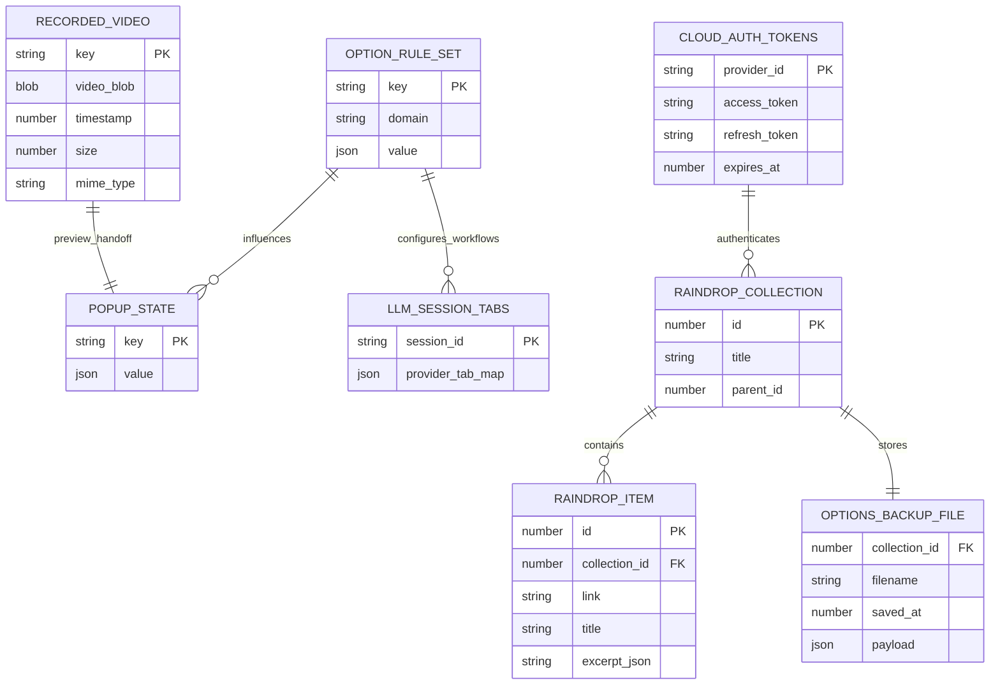

# Data Model

## Persistence Overview
Nenya persists state in three browser stores and one remote backend:
- `chrome.storage.sync`: account/token data (`cloudAuthTokens`).
- `chrome.storage.local`: feature settings/rules/UI state/session metadata.
- `chrome.storage.session`: transient runtime mappings (`llmSessionTabs`, `recordedVideoUrl`).
- IndexedDB (`nenya-recordings`): screen recording blob persistence.
- Raindrop API: session collections, unsorted items, options backup file.

## Local Storage Domains

### Auth and Cloud Linking
- `cloudAuthTokens` (sync): map of provider ID -> `{ accessToken, refreshToken, expiresAt }`
  - Written/read by `src/options/bookmarks.js` and `src/shared/tokenRefresh.js`.

### Rule Sets (local)
- `autoReloadRules`
- `darkModeRules`
- `brightModeWhitelist`
- `highlightTextRules`
- `videoEnhancementRules`
- `blockElementRules`
- `customCodeRules`
- `runCodeInPageRules`
- `urlProcessRules`
- `titleTransformRules`
- `autoGoogleLoginRules`

These are edited in `src/options/*.js` modules and consumed by background/content scripts.

### UX and Feature State (local)
- `notificationPreferences`
- `screenshotSettings`
- `clipboardHistory`
- `tabSnapshots`
- `pinnedShortcuts`
- `pinnedSearchResults`
- `customSearchEngines`
- `searchResultWeights`
- `editorSettings`
- `editorScreenshot`
- prefill keys: `highlightTextPrefillUrl`, `autoReloadPrefillUrl`, `brightModePrefillUrl`, `customCodePrefillUrl`
- command-nav flags: `openChatPage`, `openEmojiPage`
- `pipTabId`
- `renamedTabTitles`
- backup state: `optionsBackupState`

### Session Storage
- `llmSessionTabs`: serialized map `{ [sessionId]: { [providerId]: tabId } }`
- `recordedVideoUrl`: blob URL handoff between recorder and preview

### IndexedDB
- DB: `nenya-recordings`
- Store: `videos`
- Key: `current`
- Value shape: `{ blob, timestamp, size, type }` from `src/recording/storage.js`

## Remote Data Shapes

### Raindrop Sessions
- Collection hierarchy under `nenya / sessions` with per-device subcollections (`src/background/mirror.js`).
- Item `excerpt` JSON stores tab metadata (tabId, windowId, group metadata, pin/index).

### Raindrop Backup File
- Collection: `nenya / backup`
- File item: `options_backup.txt`
- Payload produced by `buildBackupPayload()` in `src/background/options-backup.js`:
  - `version`, `savedAt`, `rootFolder`, and the full option-key snapshot.

### Import/Export File
- Exported JSON from `src/options/importExport.js`:
  - top-level `version: 12`
  - `data` containing normalized rule/settings domains.

## Entity Relationship Diagram

## Indexes and Migrations
- IndexedDB schema is simple (single object store, no secondary indexes).
- Key migration mechanisms in code:
  - `pinnedItems -> pinnedSearchResults` migration in `src/background/index.js` install path.
  - sync-to-local options migration in `migrateOptionsToLocal()` (`src/background/options-backup.js`).
  - highlight rule migration via `migrateHighlightRules` (`src/shared/highlightTextMigration.js`).
