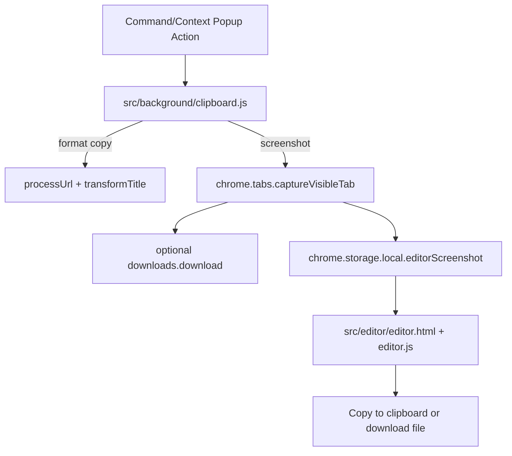

# Feature: Clipboard, Screenshot, and Editor

## What This Feature Does
User-facing:
- Copies tab metadata in multiple formats (title, title+URL, markdown link).
- Captures visible-tab screenshot and opens built-in editor.
- Optionally auto-saves screenshots to Downloads.
- Stores copied text snippets as clipboard history.

System-facing:
- Applies URL and title transformation rules before copy output.
- Routes screenshot capture to editor via storage handoff.

## Key Modules and Responsibilities
- `src/background/clipboard.js`
  - `handleClipboardCommand` + `handleMultiTabCopy`: command-driven copy formats.
  - `handleScreenshotCopy` (around line 449): screenshot capture, optional download, writes `editorScreenshot`, opens `src/editor/editor.html`.
  - Uses `processUrl` (`src/shared/urlProcessor.js`) and `transformTitle` (`src/shared/titleTransform.js`) during formatting.
- `src/background/index.js`
  - Dispatches copy commands and `clipboard:takeScreenshot`/`clipboard:saveToUnsorted` messages.
- `src/contentScript/clipboard-monitor.js`
  - Listens to page `copy` events and sends `action: 'addClipboardItem'`.
- `src/background/clipboardHistory.js`
  - Maintains top-20 deduplicated `clipboardHistory` entries in local storage.
- `src/options/clipboardHistory.js`
  - Renders clipboard history UI and per-item copy/delete actions.
- `src/editor/editor.js`
  - `Editor` class handles annotation tools, undo/redo, save/copy export, OCR worker integration.
  - `loadImage()` reads `editorScreenshot` from local storage.

## Public Interfaces
Commands (`manifest.json`):
- `copy-title`
- `copy-title-url`
- `copy-title-dash-url`
- `copy-markdown-link`
- `copy-screenshot`

Runtime messages:
- `clipboard:takeScreenshot`
- `clipboard:saveToUnsorted`
- Legacy action message from content script: `{ action: 'addClipboardItem', data }`

Context menu IDs:
- `COPY_MENU_IDS.*` from `src/shared/contextMenus.js`.

## Data Model / Storage Touches
- `chrome.storage.local`
  - `screenshotSettings`: currently `{ autoSave: boolean }`.
  - `editorScreenshot`: data URL payload passed to editor page.
  - `clipboardHistory`: array of `{ text, url, timestamp }`.
  - `editorSettings`: editor tool preferences (read/write in `Editor.loadSettings`/`saveSettings`).

## Main Control Flow

## Error Handling and Edge Cases
- Multi-tab screenshot is intentionally blocked in UI/menu visibility logic (screenshot menu hidden when multiple tabs are selected).
- Screenshot workflow returns success even if optional auto-download fails; editor opening is the primary success criterion.
- Clipboard write path relies on injected `navigator.clipboard.writeText`; failures are represented with failure badge updates.
- Clipboard history dedupes on copied `text` only (not URL+text pair).

## Observability
- Background logs use `[clipboard]` prefix in `src/background/clipboard.js`.
- UI shows action badge feedback (`setCopySuccessBadge`/`setCopyFailureBadge`).

## Tests
- No automated tests are present.
