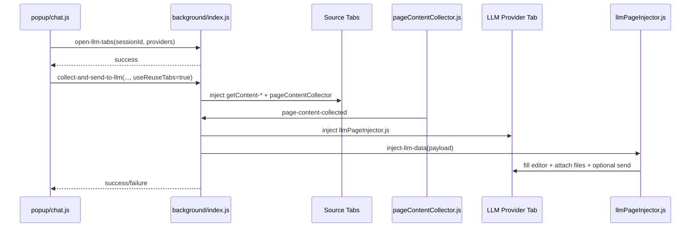

# Feature: LLM Content Collection and Injection

## What This Feature Does
User-facing:
- Sends page content from selected tabs to ChatGPT, Gemini, Claude, and Perplexity from popup chat or context menu.
- Supports reusable prompt templates and provider selection.
- Optionally attaches screenshot image data to LLM input.

System-facing:
- Extracts markdown-like page content by injecting provider-specific extraction scripts.
- Manages per-chat-session provider tabs and reuse semantics in service-worker session state.

## Key Modules and Responsibilities
- `src/popup/chat.js`
  - UI state for providers, selected tabs, prompt text, and `sessionId`.
  - Sends `open-llm-tabs`, `collect-and-send-to-llm`, `switch-llm-provider`, `close-llm-tabs`.
- `src/background/index.js`
  - `collectPageContentFromTabs` (line 2154): concurrent collection orchestration.
  - `openLLMTabs` (line 2562), `switchLLMProvider` (line 2684), `reuseLLMTabs` (line 2732): provider-tab lifecycle.
  - `handleSendToLLM` (line 2953): context-menu direct send path.
- `src/contentScript/getContent-general.js`
  - Uses Readability + Turndown to build markdown content.
- `src/contentScript/getContent-youtube.js`, `src/contentScript/getContent-notion.js`
  - Provider-specific extraction for YouTube/Notion pages.
- `src/contentScript/pageContentCollector.js`
  - Calls `window.getContent` and returns `page-content-collected` payload.
- `src/contentScript/llmPageInjector.js`
  - Receives `inject-llm-data`, inserts prompt/files into provider editor, optionally auto-clicks send button.
- `src/shared/llmProviders.js`
  - `LLM_PROVIDER_META` and send-button selectors.

## Public Interfaces
Runtime messages:
- Popup -> background:
  - `open-llm-tabs`
  - `collect-and-send-to-llm`
  - `switch-llm-provider`
  - `close-llm-tabs`
  - `collect-page-content-as-markdown`
- Content script -> background:
  - `page-content-collected`
- Background -> content script (`llmPageInjector.js`):
  - `inject-llm-data` with `{ tabs, promptContent, files, sendButtonSelector }`

Context menu:
- `send-to-llm-{providerId}` dynamic IDs defined in `src/shared/contextMenus.js` and parsed by `parseLLMMenuItem`.

## Data Model / Storage Touches
- `chrome.storage.local`
  - `chatLLMSelectedProviders` (popup selection persistence).
  - `llmPrompts` (managed by options UI, read by chat UI).
- `chrome.storage.session`
  - `llmSessionTabs`: persisted provider-tab mapping across service worker restarts.
- In-memory maps (service worker):
  - `sessionToLLMTabs`, `tabIdToSessionId`, `sessionsWithSentContent` in `src/background/index.js`.

## Main Control Flow

## Error Handling and Edge Cases
- Collection timeout:
  - Per-tab extraction uses timeout fallback in `collectPageContent` (default 10s), returning null/error content entries instead of crashing entire batch.
- Service worker restarts:
  - `ensureLLMTabSessionMapLoaded` restores session map from `chrome.storage.session`.
  - `recoverSessionLLMTabs` attempts to rebind existing provider tabs by URL.
- Tab lifecycle cleanup:
  - `tabs.onRemoved` and `runtime.onConnect(...onDisconnect)` clean up tabs for sessions that never sent content.
- Provider differences:
  - `LLM_PROVIDER_META.sendButtonSelector` is provider-specific and can fail if provider DOM changes.

## Observability
- Logs are emitted in `src/background/index.js` (`[background]`) and `src/contentScript/llmPageInjector.js` (`[llmPageInjector]`) for extraction and injection failures.

## Tests
- No automated tests exist for this feature; behavior verification is currently manual.
