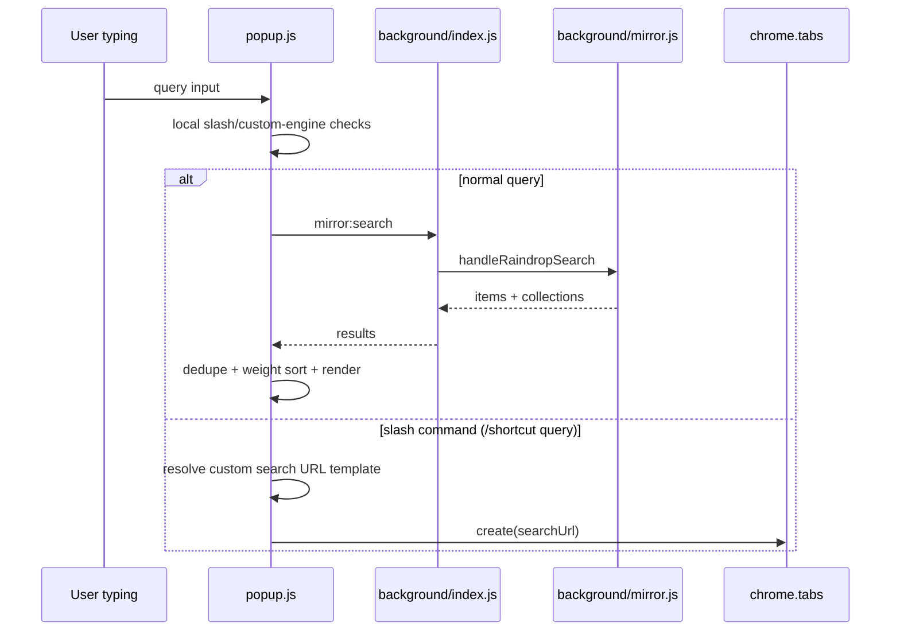

# Feature: Popup, Home, and Search UX

## What This Feature Does
User-facing:
- Provides quick-action toolbar (pinned shortcuts) in popup and home surface.
- Offers unified search over Raindrop items/collections with keyboard navigation.
- Supports custom search engine slash commands (`/shortcut query`).
- Shows and manages mirrored session collections.

System-facing:
- Reuses one controller (`src/popup/popup.js`) for two surfaces:
  - Extension popup (`src/popup/index.html`)
  - Full-tab home (`src/home/index.html` with `data-surface='home'`)

## Key Modules and Responsibilities
- `src/popup/popup.js`
  - `initializePopup` (line 2270): bootstraps auth state, shortcuts, sessions, search.
  - `initializeBookmarksSearch` (line 3078): search rendering, keyboard navigation, slash commands.
  - `initializeSessions` (line 1305): session section rendering and actions.
  - Action handlers (`handleRenameTab`, `handleAutoReload`, `handleTakeScreenshot`, `handleScreenRecording`, etc.).
- `src/popup/mirror.js`
  - Auth validation and save-to-unsorted operations.
- `src/popup/shared.js`
  - Promise wrappers for runtime messaging/tab queries.
- `src/home/index.html` + `src/home/home.css`
  - Home-specific layout while keeping popup logic unchanged.
- `src/shared/customSearchEngines.js`
  - Global helpers loaded by options page and consumed by popup search logic.

## Public Interfaces
Runtime messages sent by popup controller:
- `mirror:search`
- `mirror:fetchSessions`
- `mirror:fetchSessionDetails`
- `mirror:restoreSession`
- `mirror:updateSessionName`
- `mirror:deleteSession`
- `mirror:uploadCollectionCover`
- `mirror:updateRaindropUrl`
- `open-in-popup`
- `rename-tab`
- `launchElementPicker`
- `clipboard:*`
- `screen-recorder:toggle`
- `autoReload:getStatus`

Local flags used for command-driven navigation:
- `openChatPage`
- `openEmojiPage`

## Data Model / Storage Touches
- `chrome.storage.local`
  - `pinnedShortcuts`
  - `pinnedSearchResults`
  - `searchResultWeights`
  - `customSearchEngines`
  - UI prefill/navigation flags (`openChatPage`, `openEmojiPage`)
- `chrome.storage.sync`
  - Reads `cloudAuthTokens` through popup mirror auth checks.

## Main Control Flow

## Error Handling and Edge Cases
- Search de-duplicates by URL/title key and collection IDs before sorting.
- Query threshold for remote search avoids excessive calls (`debounce` + minimum length).
- If custom-search engine resolution fails, popup falls back to Google search URL.
- Popup/home surface differences are guarded via `CURRENT_SURFACE` and `isShortcutSupportedOnCurrentSurface`.

## Observability
- Console logs prefixed with `[popup]` for operational issues.
- Status feedback is shown in `#statusMessage` via `concludeStatus`.

## Tests
- No automated UI tests are committed.
