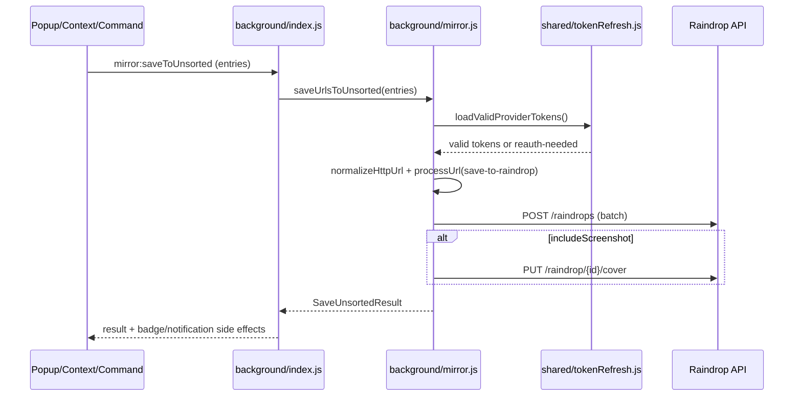

# Feature: Raindrop Sync and Sessions

## What This Feature Does
User-facing:
- Saves pages/links/clipboard URLs to Raindrop Unsorted.
- Mirrors current browser session (windows, tabs, groups, pin state, tab order) to Raindrop collections.
- Lists, renames, restores, opens, and deletes session collections from popup search/session UI.

System-facing:
- Centralizes Raindrop API access and token validation in `src/background/mirror.js`.
- Runs continuous session export via alarm-driven auto-export (`AUTO_EXPORT_ALARM_NAME`) after collection setup.

## Key Modules and Responsibilities
- `src/background/mirror.js`
  - `saveUrlsToUnsorted` (line 1315): sanitize, process, batch-create unsorted entries, optional screenshot cover upload.
  - `raindropRequest` (line 1744): authenticated API wrapper.
  - Session APIs:
    - `handleFetchSessions` (line 282)
    - `handleRestoreSession` (line 446)
    - `handleOpenAllItemsInCollection` (line 576)
    - `handleUpdateSessionName` (line 4310)
    - `handleUploadCollectionCover` (line 4345)
    - `handleDeleteSession` (line 4376)
  - Export core:
    - `ensureNenyaSessionsCollection` (line 2438)
    - `exportCurrentSessionToRaindrop` (line 2725)
    - `ensureDeviceCollectionAndExport` (around line 2380)
- `src/background/index.js`
  - Dispatches `mirror:*` runtime messages (`onMessage` at line 3103).
  - Handles shortcut/context-menu entry points for save-to-unsorted.
- `src/shared/tokenRefresh.js`
  - `getValidTokens`, `refreshAccessToken`, and message constant `auth:validateTokens`.
- `src/popup/mirror.js`
  - Popup-side wrappers for save actions and token-state UI.

## Public Interfaces
Runtime messages (handled in `src/background/index.js`):
- `mirror:saveToUnsorted`
- `mirror:encryptAndSave`
- `mirror:search`
- `mirror:fetchSessions`
- `mirror:fetchSessionDetails`
- `mirror:restoreSession`
- `mirror:restoreWindow`
- `mirror:restoreGroup`
- `mirror:restoreTab`
- `mirror:openAllItems`
- `mirror:saveSession`
- `mirror:ensureSessionsCollection`
- `mirror:updateSessionName`
- `mirror:deleteSession`
- `mirror:uploadCollectionCover`
- `mirror:updateRaindropUrl`

Commands/context menus:
- Commands from `manifest.json`: `bookmarks-save-to-unsorted`, `bookmarks-save-to-unsorted-encrypted`, `bookmarks-save-clipboard-to-unsorted`.
- Context menu IDs from `src/shared/contextMenus.js`: `RAINDROP_MENU_IDS.*`.

## Data Model / Storage Touches
- `chrome.storage.sync`
  - `cloudAuthTokens`: provider token map (read by `loadValidProviderTokens`).
- `chrome.storage.local`
  - `mirrorRootFolderSettings`: root folder behavior for bookmark mirror.
  - `raindropItemBookmarkMap`: local map used by mirror logic.
  - `notificationPreferences`: notification gating for bookmark/clipboard events.
- Raindrop entities (remote)
  - Collections: `/collections`, `/collection`, `/collections/childrens`.
  - Items: `/raindrops/{collectionId}`, `/raindrop/{itemId}`, `/raindrop/{itemId}/cover`.

## Main Control Flow

## Error Handling and Edge Cases
- Token lifecycle:
  - Expired tokens are refreshed via `getValidTokens` in `src/shared/tokenRefresh.js`; failures return reauth-needed.
- Batch semantics:
  - `saveUrlsToUnsorted` accumulates partial failures in `errors[]` and counts `created/skipped/failed` instead of failing hard on first error.
- Duplicate handling:
  - Dedupes input URL entries before API calls; remote dedupe logic intentionally avoids broken search endpoint path (comment in `filterExistingRaindropEntries`).
- Session export concurrency:
  - `ensureDeviceCollectionAndExport` serializes concurrent exports using `currentExportPromise`.
- Known mismatch to track:
  - `src/background/raindrop-export.js` contains standalone export-to-bookmarks workflow but is not wired from `src/background/index.js`.

## Observability
- Extensive structured logs with feature prefixes (`[mirror]`, `[notifications]`) throughout `src/background/mirror.js`.
- User-facing notifications emitted through `pushNotification` (line 1105), gated by `notificationPreferences`.

## Tests
- No automated tests for this feature are present in repository scripts (`package.json` has no runnable test suite).
