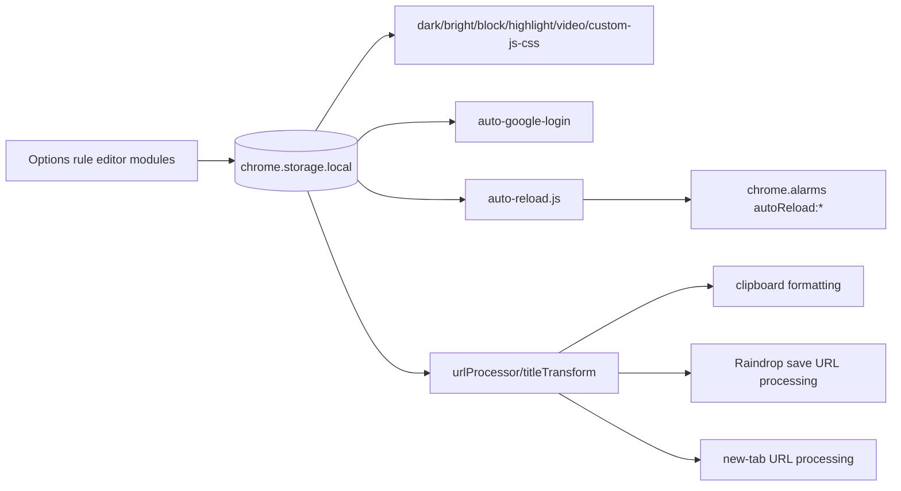

# Feature: Rule-Based Page Automation

## What This Feature Does
User-facing:
- Applies URLPattern-based automation and transformation:
  - Dark mode, bright mode, element blocking, text highlighting, video enhancements, custom JS/CSS injection.
  - Auto reload schedules by URL pattern.
  - URL processing and title transformation before copy/save/open.
  - Auto Google login flows by URL pattern + preferred email.

System-facing:
- Option editors persist normalized rule arrays in `chrome.storage.local`.
- Content scripts evaluate rules and act in-page.
- Background modules consume rule sets for scheduled or cross-tab actions.

## Key Modules and Responsibilities
Content scripts:
- `src/contentScript/darkMode.js`: applies DarkReader for matching `darkModeRules`.
- `src/contentScript/bright-mode.js`: forces bright/invert CSS for `brightModeWhitelist`.
- `src/contentScript/block-elements.js`: hides selectors from `blockElementRules`; supports reapply message.
- `src/contentScript/highlight-text.js`: applies highlight entries from `highlightTextRules`.
- `src/contentScript/video-controller.js`: PiP tracking + auto-fullscreen rule handling (`videoEnhancementRules`).
- `src/contentScript/custom-js-css.js`: injects CSS locally and delegates JS execution to background via `INJECT_CUSTOM_JS`.
- `src/contentScript/auto-google-login.js`: rule-matched login button detection and OAuth account selection automation.

Background/shared:
- `src/background/auto-reload.js`: evaluates `autoReloadRules`, schedules per-tab alarms `autoReload:{tabId}`, updates badge countdown.
- `src/shared/urlProcessor.js`: applies `urlProcessRules` by `applyWhen` context.
- `src/shared/titleTransform.js`: applies `titleTransformRules` before copy operations.
- `src/background/index.js`: runtime handlers for rule-assisted actions (`INJECT_CUSTOM_JS`, `blockElement:addSelector`, `autoReload:getStatus`, URL open processing via `webNavigation.onBeforeNavigate`).

Options rule editors:
- `src/options/*.js` modules each own one rule domain (`autoReload.js`, `highlightText.js`, `blockElements.js`, `customCode.js`, `videoEnhancements.js`, `autoGoogleLogin.js`, `urlProcessRules.js`, `titleTransformRules.js`, etc.).

## Public Interfaces
Runtime messages:
- `INJECT_CUSTOM_JS`
- `blockElement:addSelector`
- `blockElement:reapplyRules` (background -> content)
- `autoReload:getStatus`
- `autoReload:reEvaluate`
- `auto-google-login-notification`
- `auto-google-login:checkTabActive`

Context menu helpers:
- Prefill-to-options actions for bright mode, highlight text, auto reload, custom code from `src/background/index.js` (`brightModePrefillUrl`, `highlightTextPrefillUrl`, `autoReloadPrefillUrl`, `customCodePrefillUrl`).

## Data Model / Storage Touches
Rule keys in `chrome.storage.local`:
- `darkModeRules`
- `brightModeWhitelist`
- `blockElementRules`
- `highlightTextRules`
- `videoEnhancementRules`
- `customCodeRules`
- `runCodeInPageRules`
- `autoGoogleLoginRules`
- `autoReloadRules`
- `urlProcessRules`
- `titleTransformRules`

Other feature keys:
- `pipTabId`
- `autoGoogleLoginTempEmail`
- `autoGoogleLoginInitiated`

## Main Control Flow

## Error Handling and Edge Cases
- Most rule editors sanitize and re-persist malformed data (`normalizeRules` patterns across `src/options/*.js` and `src/background/auto-reload.js`).
- Auto reload chooses shortest matching interval and enforces `MIN_INTERVAL_SECONDS`.
- Custom JS execution uses `chrome.scripting.executeScript(... world: 'MAIN')` with wrapped `eval` try/catch.
- Known consistency issues to watch:
  - Some content scripts read from `chrome.storage.local` but check storage change events only when `area === 'sync'` (for example bright mode/video controller/auto-google-login handlers).
  - `darkMode.js` does not subscribe to rule-storage changes, so changed rules may require reload/theme change.

## Observability
- Feature-specific log prefixes: `[auto-reload]`, `[BrightMode]`, `[auto-google-login]`, `[highlight]`, `[Nenya CustomCode]`.
- Auto reload exposes lightweight status (`autoReload:getStatus`) used by popup/home countdown display.

## Tests
- No automated tests are present for rule evaluation or content-script behavior.
