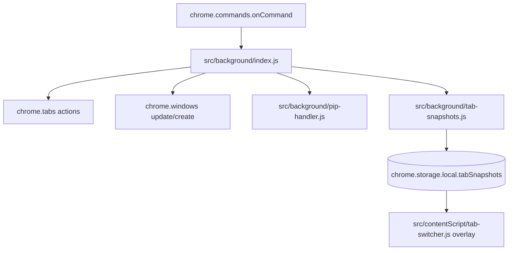

# Feature: Tab and Window Utilities

## What This Feature Does
User-facing:
- Navigates tabs with shortcuts, opens tab to the right, closes highlighted/active tabs.
- Resizes windows (halves/fullscreen), arranges split-screen style layouts, merges single-tab windows.
- Renames tabs persistently for the session.
- Opens current page in popup window.
- Triggers Picture-in-Picture for largest page video.
- Maintains recent tab snapshots (thumbnail + metadata) for switching UI.

System-facing:
- Utility commands are concentrated in `src/background/index.js` command handler and helper functions.
- Snapshot capture is delegated to `src/background/tab-snapshots.js`.

## Key Modules and Responsibilities
- `src/background/index.js`
  - Command entrypoint: `chrome.commands.onCommand` (line 244).
  - Tab/window helpers:
    - `createTabNextToActive`
    - `closeHighlightedOrActiveTabs`
    - split/window resize helpers (`arrangeSingleTabSplit` and related functions)
  - Rename handling via runtime message `rename-tab`.
  - Context-menu utility handlers (`open-in-popup`, PiP, element picker, screenshot, etc.).
- `src/background/popup.js`
  - `handleOpenInPopup`: opens current URL in `type: 'popup'` window.
- `src/background/pip-handler.js`
  - `handlePictureInPicture`: chooses largest video and toggles PiP in target tab.
- `src/background/tab-snapshots.js`
  - Captures active-tab screenshots and stores rolling `tabSnapshots` list.
- `src/contentScript/tab-switcher.js`
  - Renders overlay UI and expects `tab-switcher:*` runtime contracts.

## Public Interfaces
Keyboard commands (from `manifest.json`):
- `tabs-activate-left-tab`
- `tabs-activate-right-tab`
- `tabs-new-tab`
- `tabs-close-tab`
- `split-screen-arrange`
- `window-resize-fullscreen`
- `window-resize-left-half`
- `window-resize-right-half`
- `window-resize-top-half`
- `window-resize-bottom-half`
- `window-merge-single-tab-windows`
- `rename-tab`
- `open-in-popup`
- `pip-quit`
- `open-pinned-shortcut-{1..5}`

Runtime messages:
- `rename-tab`
- `open-in-popup`
- `launchElementPicker`
- tab-switcher message family from content script (`tab-switcher:*`)

## Data Model / Storage Touches
- `chrome.storage.local`
  - `tabSnapshots`
  - `renamedTabTitles`
  - `pipTabId`
  - `pinnedSearchResults` (used by `open-pinned-shortcut-*` command mapping)

## Main Control Flow

## Error Handling and Edge Cases
- Tab creation preserves current group when possible (`createTabNextToActive`).
- Context menu screenshot entry is hidden when multiple tabs are highlighted.
- PiP quit command uses stored `pipTabId` and safely no-ops if missing.
- Known gaps:
  - `tab-switcher.js` sends `tab-switcher:*` messages, but matching handlers are not implemented in `src/background/index.js`.
  - Project-related context menu helper references (`saveTabsAsProject`, dynamic `./projects.js`) exist in `index.js`, but backing module is absent.

## Observability
- Logs use `[commands]`, `[contextMenu]`, `[tab-snapshots]`, and `[background]` prefixes.

## Tests
- No automated tests are provided for command/window behaviors.
